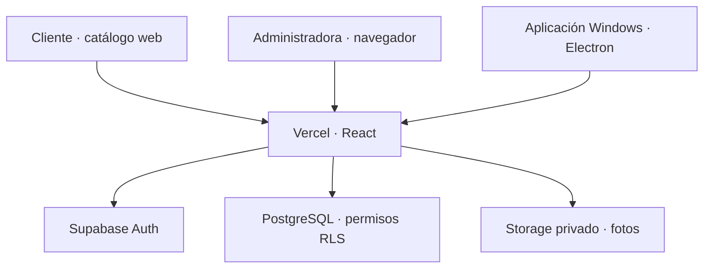
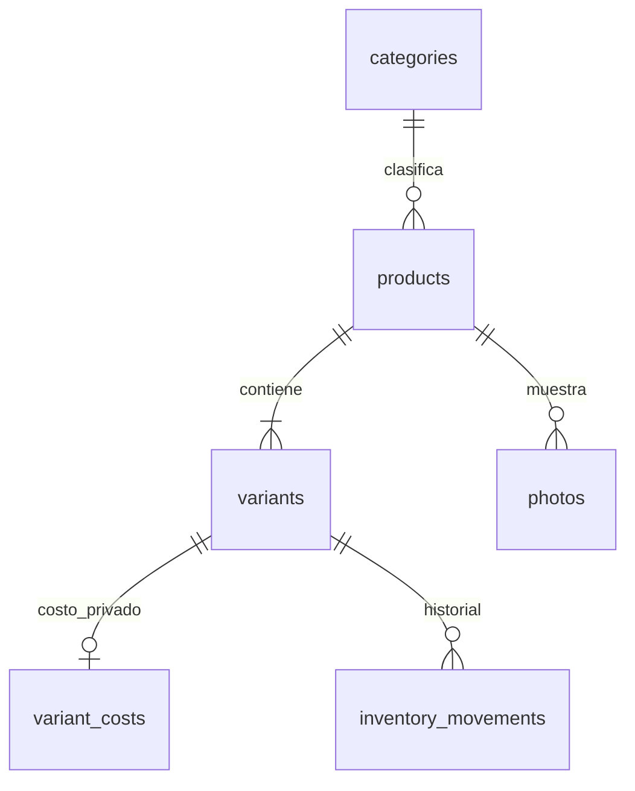

# Arquitectura de Duna Boutique

## Flujo

El ejecutable es un contenedor de la misma aplicación web. No arranca un servidor local ni almacena un segundo inventario. Cada computadora inicia sesión con Supabase; la ventana Electron conserva su sesión en el perfil local del usuario. Cierra sesión en máquinas compartidas. La versión portable tampoco pretende trasladar una sesión entre computadoras.

## Modelo

| Tabla                 | Datos                                                          | Lectura pública                 | Escritura                        |
| --------------------- | -------------------------------------------------------------- | ------------------------------- | -------------------------------- |
| `categories`          | Cinco categorías iniciales                                     | Sí                              | SQL del propietario              |
| `products`            | Nombre, descripción, marca, género, publicación, revisión      | Solo publicados                 | RPC con admin                    |
| `variants`            | SKU, barras, talla, color, presentación, precio, stock, activa | Activas de productos publicados | RPC con admin                    |
| `variant_costs`       | Costo de compra                                                | No                              | RPC con admin                    |
| `photos`              | Ruta de objeto, producto y orden                               | Fotos de publicados             | Admin                            |
| `inventory_movements` | Delta, motivo, actor, fecha, idempotencia                      | No                              | RPC de inventario / alta inicial |
| `admin_users`         | UUID de cuenta autorizada                                      | No                              | SQL del propietario              |

El costo está en una tabla separada: ocultar una columna en la interfaz no sería suficiente para protegerla. El visitante sí puede consultar cantidades y códigos de variantes publicadas mediante la API, aunque la ficha visual solo indique disponibilidad. Si se requiere confidencialidad del stock exacto, se debe añadir una vista/API que exponga únicamente disponibilidad y revocar la lectura directa de variantes.

## Reglas

- Precio y costo: decimal `numeric(12,2)`, sin negativos. Stock: entero no negativo.
- Barras: texto único opcional; SKU: texto único obligatorio. Se conserva `000123`.
- Una variante inactiva no aparece públicamente ni cuenta en disponibilidad. Su stock e historial se conservan.
- No se permite eliminar físicamente productos desde el panel; se ocultan con publicación y se conservan referencias históricas.
- `save_product`: guarda metadatos, variantes y costos en una sola transacción. Al crear variantes registra existencias iniciales. Al editar nunca modifica el stock existente.
- `adjust_stock`: bloquea el producto, comprueba saldo, registra movimiento y actualiza stock en la misma transacción. UUID por intento lógico evita aplicar dos veces el mismo movimiento al reintentar.
- `revision`: bloqueo optimista del editor. Los movimientos también incrementan la revisión del producto.
- Fotos: carga de objetos separada del guardado de metadatos. Si falla insertar referencia, se intenta eliminar el objeto recién subido. Un fallo de red en ese paso puede dejar objetos huérfanos para limpiar administrativamente.
- Portada: RPC transaccional `set_cover_photo`, orden compartido para todas las variantes. Esta versión tiene galería por producto, no asignación específica de fotos por variante.
- Las categorías iniciales se gestionan por código/SQL; no hay editor de categorías en el panel. Al ampliarlas, actualiza la tabla y `src/types.ts`.

## Seguridad

- No hay claves privadas ni cuentas predeterminadas en el repositorio.
- RLS y permisos de tabla impiden escrituras anónimas y de cuentas sin rol. Los administradores no pueden otorgarse roles desde el frontend.
- Funciones `security definer` con `search_path` vacío, tablas calificadas y autorización explícita. Se revoca ejecución de `public`.
- Bucket privado limitado a JPG/PNG/WebP y 5 MB por archivo. Solo administradores suben o eliminan. Se comprueba visibilidad al firmar enlaces de lectura.
- Las URLs firmadas de imágenes duran cinco minutos. Una imagen ya descargada o una URL ya emitida no se puede retirar instantáneamente al ocultar un producto; deja de emitirse a nuevos visitantes y la URL caduca.
- CSP en Vercel, sin iframes, contenido activo de objetos ni permisos de cámara/micrófono.
- Electron sin Node en el renderer, con sandbox y context isolation. Solo carga HTTPS del origen configurado, bloquea navegación ajena, descargas y permisos del dispositivo. No existe un puente IPC con acceso al sistema.
- Un administrador puede subir cualquier imagen permitida por el formato; este código no implementa moderación de contenido ni antivirus de servidor. Las contraseñas y recuperación las gestiona Supabase.

## Operación y límites

El refresco cada 30 segundos ofrece consistencia eventual en las pantallas. La integridad de cada movimiento sí es transaccional. El editor detecta conflictos y pide recargar; no combina automáticamente dos cambios.

Se cargan los productos paginados en lotes de 300 y se filtran en el navegador. Para un catálogo grande, migrar búsqueda/filtros a PostgreSQL, paginación visible y carga de fotos por página. No se afirma capacidad de carga masiva o rendimiento de producción sin medirlo.

No hay reservas, órdenes, ventas con ticket, compras en línea, clientes, caja, facturas, múltiples sucursales, tareas offline, exportación desde UI ni roles de empleado. El movimiento de salida permite registrar una venta manual de inventario, sin ser un POS.

El respaldo debe cubrir PostgreSQL y Storage por separado. El código y los instaladores no contienen la mercancía del negocio.
